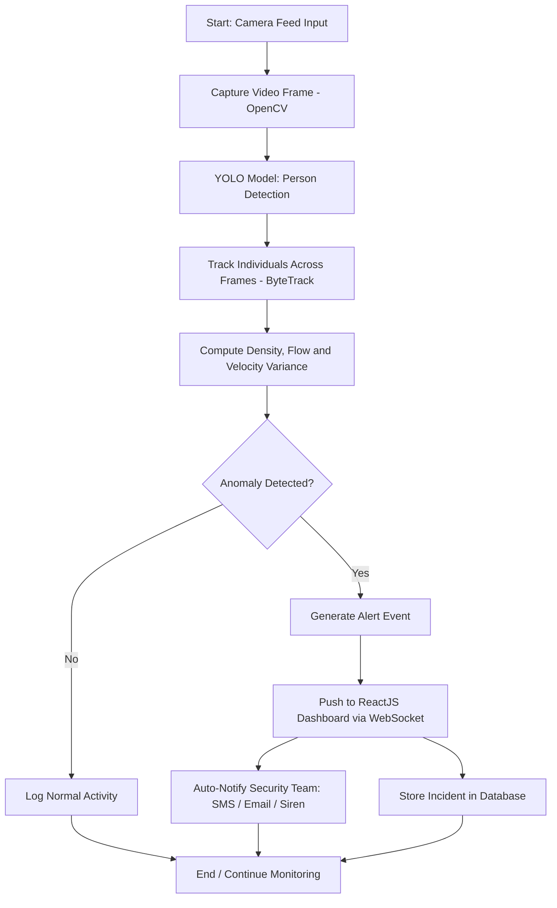

# System Design — SafeCrowd

## Three-tier architecture

**1. Perception Tier**
Video feeds are split into frames (OpenCV) and passed through a YOLOv8 model
fine-tuned on CrowdHuman to obtain person bounding boxes and per-frame
headcount. See `ml/detection/`.

**2. Analytics Tier**
ByteTrack links bounding boxes across consecutive frames into trajectories,
from which we compute: spatial density per zone, directional movement
vectors, and velocity variance. See `ml/tracking/` and `ml/analytics/`.

**3. Alerting Tier**
Anomaly rules compare the computed crowd parameters against baseline
thresholds. On a confirmed anomaly, an alert is broadcast to the dashboard via
WebSocket and logged to PostgreSQL. See `backend/`.

## End-to-end flowchart



## Data flow between services

```
IP Camera (RTSP) → ml-worker (Perception + Analytics Tiers)
                        │
                        ▼
                  Redis (live alert queue)
                        │
                        ▼
              FastAPI backend (WebSocket broadcaster)
                        │
            ┌───────────┴───────────┐
            ▼                       ▼
   ReactJS Dashboard        PostgreSQL (incident history)
```

## Deployment architecture

- Each tier runs as its own Docker container: `ml-worker`, `backend`,
  `frontend`, plus `postgres` and `redis` as managed services in
  `docker-compose.yml`.
- `ml-worker` is the only container that needs GPU access — run it on the
  GPU-enabled edge device (e.g. NVIDIA Jetson) or server; `backend` and
  `frontend` can run on commodity hardware.
- RTSP stream processing happens locally on the edge GPU box before anything
  is sent upstream, to avoid network latency/congestion from raw video
  transmission (only lightweight metrics/alerts cross the network).

## Known limitations (carried over from the project's risk analysis)

- Severe occlusion or poor lighting degrades detection accuracy — mitigated
  with low-light preprocessing and multi-angle camera coverage where possible.
- At extreme density, per-person tracking degrades — the system is designed
  to fall back on aggregate directional motion vectors rather than relying on
  individual track continuity in that regime.
